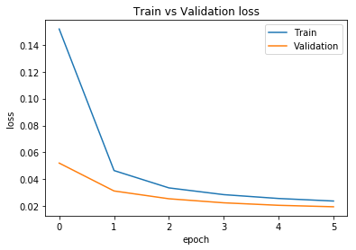

# Shakkala Project V 2.0 مشروع شكّالة


## Introduction
Shakkala project use recurrent neural network for Arabic text vocalization to automatically form Arabic characters (تشكيل الحروف) which can be used to enhance text-to-speech systems.<br/>
This model can be used in many applications such as enhance text-to-speech systems or search results.

## Requirements
Execute following commands:<br/>
```
cd requirements
pip install -r requirements.txt
```

## Code Examples (How to)
Check full example in (demo.py) file.<br/>

1. Create Shakkala object
```
sh = Shakkala(folder_location, version={version_num})
```
2. Prepare input
```
input_int = sh.prepare_input(input_text)
```
3. Call the neural network
```
model, graph = sh.get_model()
with graph.as_default():
  logits = model.predict(input_int)[0]
```
4. Predict output
```
predicted_harakat = sh.logits_to_text(logits)
final_output = sh.get_final_text(input_text, predicted_harakat)
```
Available models <br>

- version_num=1: this first test of the solution.
- version_num=2: main release version.
- version_num=3: some enhancements from version number 2.

If worth to try both 2 and 3

## Accuracy
In this beta version 2 accuracy reached almost 95% and in some data it reach more.
This beta version trained on majority of historical Arabic data from books and some of available formed modern data in the internet.<br/>



### Prediction Example
For live demo based on Shakkala library click the [link](http://ahmadai.com/shakkala/) <br/>

| Real output | Predicted output |
| ------------- | ---------------- |
| فَإِنْ لَمْ يَكُونَا كَذَلِكَ أَتَى بِمَا يَقْتَضِيهِ الْحَالُ وَهَذَا أَوْلَى  | فَإِنْ لَمْ يَكُونَا كَذَلِكَ أَتَى بِمَا يَقْتَضِيهِ الْحَالُ وَهَذَا أَوْلَى |
| قَالَ الْإِسْنَوِيُّ  وَسَوَاءٌ فِيمَا قَالُوهُ مَاتَ فِي حَيَاةِ أَبَوَيْهِ أَمْ لَا  | قَالَ الْإِسْنَوِيُّ  وَسَوَاءٌ فِيمَا قَالُوهُ مَاتَ فِي حَيَاةِ أَبَوَيْهِ أَمْ لَا  |
| طَابِعَةٌ ثُلَاثِيَّةُ الْأَبْعَاد | طَابِعَةٌ ثَلَاثِيَّةُ الْأَبْعَادِ  |

### Accuracy Enhancements  
The model can be enhanced to reach more than 95% accuracy with following:<br/>
- Availability of more modern formed data to train the network. (because current version trained with mostly available historical Arabic data and some modern data)
- Stack different models

## Model Design


## Contribution
### Core Team
1. Ahmad Barqawi: Neural Network Developer.<br/>
2. Taha Zerrouki: Mentor Data and Results.<br/>
### Contributors
1. Zaid Farekh & propellerinc.me: Provide infrastructure and consultation support.<br/>
2. Mohammad Issam Aklik: Artist.<br/>
3. Brahim Sidi: Form new sentences.<br/>
4. Fadi Bakoura: Aggregate online content.<br/>
5. Ola Ghanem: Testing.<br/>

License
-------
Free to use and distribute only mention the original project name Shakkala as base model.<br/>

  The MIT License (MIT)

  Copyright (c) 2017 Shakkala Project

  Permission is hereby granted, free of charge, to any person obtaining a copy
  of this software and associated documentation files (the "Software"), to deal
  in the Software without restriction, including without limitation the rights
  to use, copy, modify, merge, publish, distribute, sublicense, and/or sell
  copies of the Software, and to permit persons to whom the Software is
  furnished to do so, subject to the following conditions:

  The above copyright notice and this permission notice shall be included in all
  copies or substantial portions of the Software.
