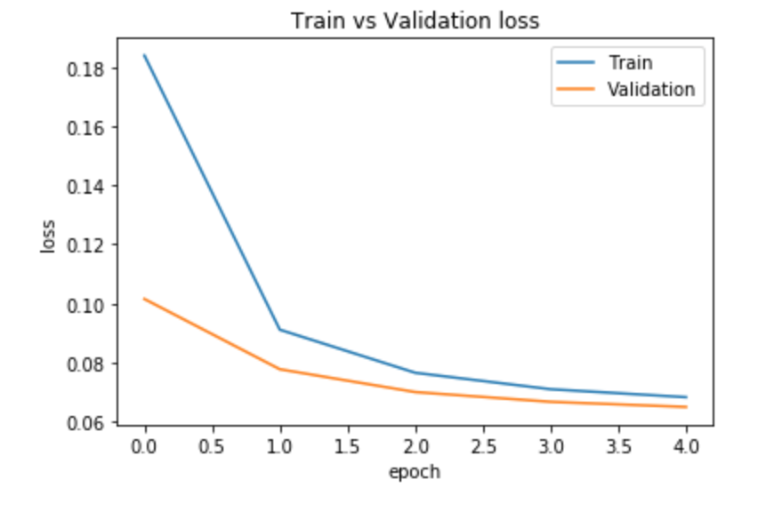

# Shakkala Project V 0.1 مشروع شكّالة
## Introduction
Shakkala project use recurrent neural network to automatically form Arabic characters (تشكيل الحروف).<br/>
This is beta version 0.1

## Requirements
Execute following commands:<br/>
```
cd requirements
pip install -r requirements.txt
```
## Code Examples (How to)
Check full example in (demo.py) file.<br/>

1. Create Shakkala object
```
sh = Shakkala(folder_location)
```
2. Prepare input
```
input_int = sh.prepare_input(input_text)
```
3. Call the neural network
```
model, graph = sh.get_model()
with graph.as_default():
      logits = model.predict(input_int)[0]
```
4. Predict output
```
predicted_harakat = sh.logits_to_text(logits)
final_output = sh.get_final_text(input_text, predicted_harakat)
```

## Accuracy
This beta version trained with personal computer on historical Arabic data and reached accuracy of almost 90%.

### Lose History


### Prediction Example
- Real output :<br/>
فَإِنْ لَمْ يَكُونَا كَذَلِكَ أَتَى بِمَا يَقْتَضِيهِ الْحَالُ وَهَذَا أَوْلَى
- Predicted output :<br/>
فَإِنْ لَمْ يَكُونُا كَذَلِكَ أَتَى بِمَا يَقْتَضِيهِ الْحَالُ وَهُذَا أَوْلَى

### Accuracy Enhancements  
The model can be enhanced to reach 95%-98% a  ccuracy with following:<br/>
- Availability of modern formed data to train the network. (because current version trained with the available historical Arabic data only)
- Rent a server with high GPU to increase the number of epochs, layer and neural units.

## Team
1. Ahmad Barqawi: Neural Network Developer.<br/>
2. Taha Zerrouki: Mentor Data and Results.<br/>


License
-------
    The MIT License (MIT)

    Copyright (c) 2017 Shakkala Project

    Permission is hereby granted, free of charge, to any person obtaining a copy
    of this software and associated documentation files (the "Software"), to deal
    in the Software without restriction, including without limitation the rights
    to use, copy, modify, merge, publish, distribute, sublicense, and/or sell
    copies of the Software, and to permit persons to whom the Software is
    furnished to do so, subject to the following conditions:

    The above copyright notice and this permission notice shall be included in all
    copies or substantial portions of the Software.
