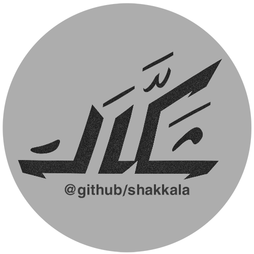
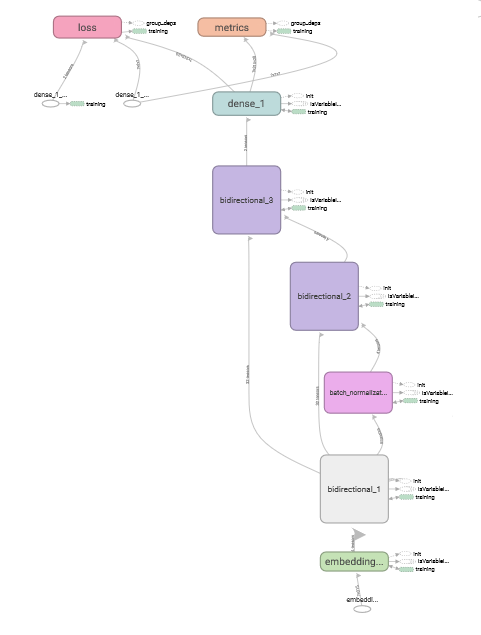

# Shakkala Project V 1.0 مشروع شكّالة



## Introduction
Shakkala project use recurrent neural network to automatically form Arabic characters (تشكيل الحروف).<br/>
This is beta version 1.0 with big improve from previous version 0.1

## Requirements
Execute following commands:<br/>
```
cd requirements
pip install -r requirements.txt
```

## Code Examples (How to)
Check full example in (demo.py) file.<br/>

1. Create Shakkala object
```
sh = Shakkala(folder_location)
```
2. Prepare input
```
input_int = sh.prepare_input(input_text)
```
3. Call the neural network
```
model, graph = sh.get_model()
with graph.as_default():
      logits = model.predict(input_int)[0]
```
4. Predict output
```
predicted_harakat = sh.logits_to_text(logits)
final_output = sh.get_final_text(input_text, predicted_harakat)
```

## Accuracy
In this version accuracy reached almost 90% and in some data it reach more.
This beta version trained on personal computer with majority of historical Arabic data from books and some of available formed modern data in the internet.

### Prediction Example
For live demo based on Shakkala library click the [link](http://ahmadai.com/shakkala/) <br/>
Following results predicted with model (middle_model.h5)
## Example1
- Real output :<br/>
فَإِنْ لَمْ يَكُونَا كَذَلِكَ أَتَى بِمَا يَقْتَضِيهِ الْحَالُ وَهَذَا أَوْلَى
- Predicted output :<br/>
فَإِنْ لَمْ يَكُونَا كَذَلِكَ أَتَى بِمَا يَقْتَضِيهِ الْحَالَ وَهَذَا أَوْلَى

## Example2
- Real output :<br/>
قَالَ الْإِسْنَوِيُّ  وَسَوَاءٌ فِيمَا قَالُوهُ مَاتَ فِي حَيَاةِ أَبَوَيْهِ أَمْ لَا
- Predicted output :<br/>
قَالَ الْإِسْنَوِيُّ  وَسَوَاءٌ فِيمَا قَالُوهُ مَاتَ فِي حَيَاةِ أَبَوَيْهِ أَمْ لَا


### Accuracy Enhancements  
The model can be enhanced to reach 95%-98% accuracy with following:<br/>
- Availability of modern formed data to train the network. (because current version trained with mostly available historical Arabic data and some modern data)
- Rent a server with high GPU to increase the number of epochs, layer and neural units.

### Model Design


## Team
1. Ahmad Barqawi: Neural Network Developer.<br/>
2. Taha Zerrouki: Mentor Data and Results.<br/>
3. Mohammad Issam Aklik: Artist.<br/>

License
-------
Free to use and distribute only mention the original project name Shakkala as base model.
    The MIT License (MIT)

    Copyright (c) 2017 Shakkala Project

    Permission is hereby granted, free of charge, to any person obtaining a copy
    of this software and associated documentation files (the "Software"), to deal
    in the Software without restriction, including without limitation the rights
    to use, copy, modify, merge, publish, distribute, sublicense, and/or sell
    copies of the Software, and to permit persons to whom the Software is
    furnished to do so, subject to the following conditions:

    The above copyright notice and this permission notice shall be included in all
    copies or substantial portions of the Software.
